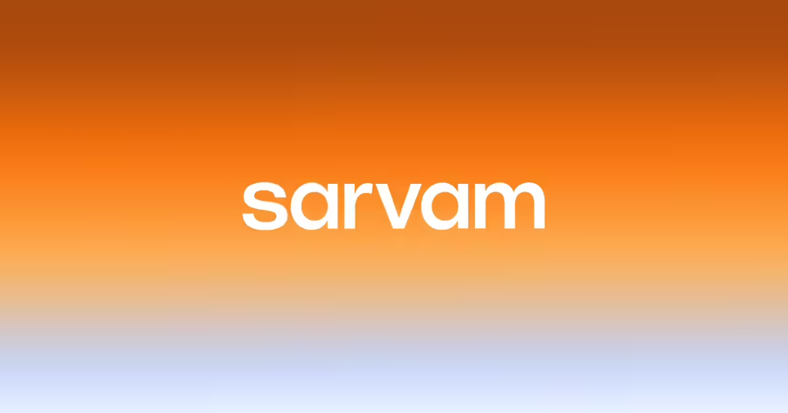
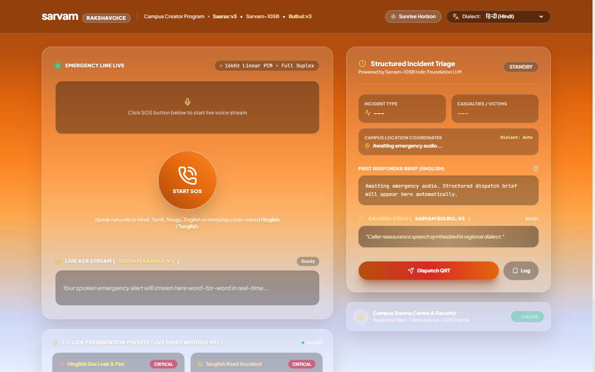
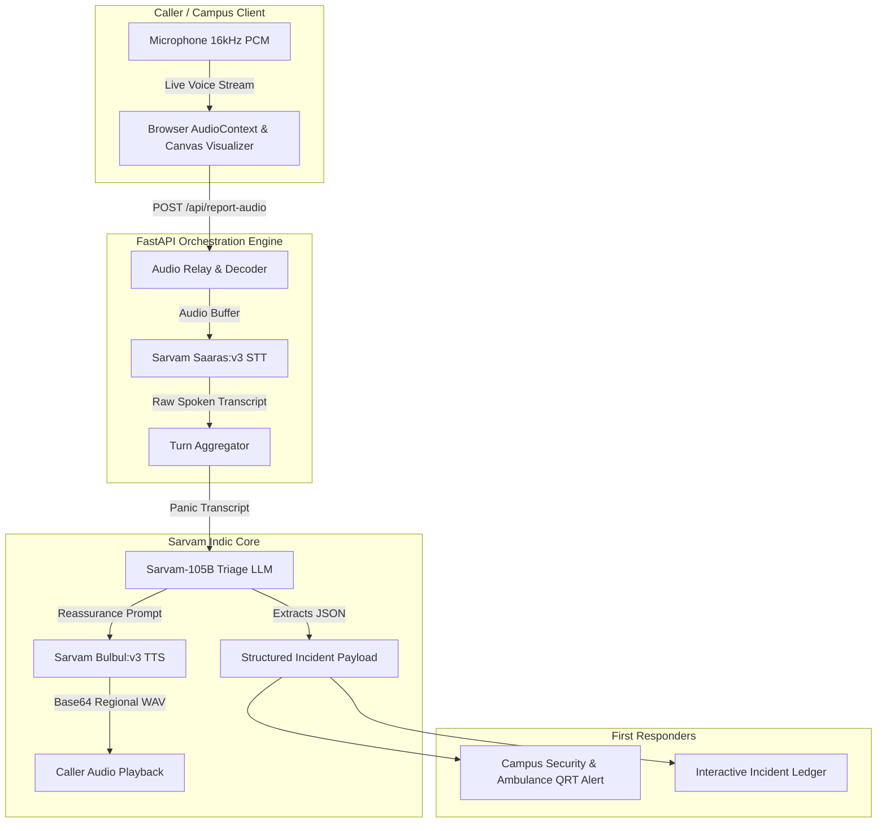

<div align="center">

# 🛡️ RakshaVoice (रक्ष-Voice)
### Real-Time Multilingual Emergency Alert & Voice Dispatch Agent

[](https://opensource.org/licenses/MIT)
[](https://www.python.org/downloads/)
[](https://fastapi.tiangolo.com)
[](https://sarvam.ai)

**Built for the Sarvam AI Campus Creator Program**  
*A sovereign Indic voice dispatch agent that takes speech in any Indian language or code-mixed dialect and routes structured emergency alerts with sub-second latency.*

---



</div>

---

## 📸 User Interface Showcase

The frontend is styled using the official **Sarvam AI "Bhor / Indic Dawn" Horizon Palette** (`#A8490E` ➔ `#FB8521` ➔ `#CED7F6`), complete with frosted glassmorphism, responsive canvas oscilloscope, and interactive micro-animations.

<div align="center">

### 🌅 Live Emergency Dispatch Console


</div>

---

## 🚨 The Problem

During campus accidents, chemical laboratory fires, and civil defense emergencies, panicked callers rarely speak textbook English or formal Hindi. Instead, they speak fast, colloquial, code-mixed phrases:

> *"Chemistry lab mein cylinder leak aur aag lag gayi hai, do juniors behosh hain, hostel 4 ke peeche jaldi ambulance bhejo!"*

Generic Western speech models (Whisper / Siri) struggle with regional dialects, accents, and heavy code-switching (**Hinglish**, **Tanglish**, **Telugu**, **Bengali**). This leads to dropped calls, delayed dispatching, and misdirected first responders.

---

## ⚡ The Solution: The Sarvam AI Foundational Pipeline

**RakshaVoice** leverages the newest generation of Sarvam AI foundational models:

| Pipeline Step | Sarvam Model | Role & Differentiator |
|---|---|---|
| **1. Speech-to-Text** | `saaras:v3` | 16kHz full-duplex stream capturing code-switched Indian speech with zero phonetic hallucination. |
| **2. Triage & Extraction** | `sarvam-105b-conversations` | 105B-parameter Indic foundational LLM extracting structured JSON telemetry with sub-second latency. |
| **3. Reassurance Voice** | `bulbul:v3` | Generates natural, calming Indic voice response in the caller's regional accent (*Aditya*, *Vijay*, *Kavitha*). |

---

## 🎨 UI Features & Micro-Animations

- **Sarvam Horizon Sunrise Gradient**: Multi-stop earthen terracotta to saffron dawn (`#A8490E` ➔ `#E3670D` ➔ `#FB8521` ➔ `#FDA84D` ➔ `#CED7F6`).
- **Pulsing Emergency SOS Button**: 3D gradient button with radiant saffron pulse aura and hover micro-animations.
- **Oscilloscope Waveform Visualizer**: Real-time canvas rendering microphone soundwaves in glowing white and marigold.
- **Audio Equalizer Dance**: Animated multi-bar sound visualizer that dances during Bulbul:v3 voice playback.
- **Radar Ping Status**: Concentric expanding waves signaling active WebSocket telemetry.
- **Theme Switcher**: Instant 1-click toggle between **Sunrise Horizon** and **Midnight Saffron**.
- **1-Click Live-Demo Presets**: Presentation buttons with hover micro-lifts to demonstrate Hinglish, Tanglish, and Telugu scenarios during hackathons without needing microphone permissions.

---

## 🏗️ System Architecture



---

## 📋 Structured Incident Schema

The panic audio is instantaneously converted into machine-readable JSON:

```json
{
  "incident_type": "LAB_DISASTER",
  "urgency": "CRITICAL",
  "location": "Chemistry lab, behind Hostel 4",
  "victims_count": 2,
  "detected_language": "Hinglish",
  "summary_en": "A fire and cylinder leak have occurred in the chemistry lab with two unconscious junior students; dispatch an ambulance immediately to the area behind Hostel 4.",
  "reassurance_indic": "Ghabraiye mat, hum turant madad bhej rahe hain, ambulance aur rescue team jaldi pahunch rahi hai."
}
```

---

## 🚀 Quickstart Guide

### 1. Clone the Repository
```bash
git clone https://github.com/SriRamkunamsetty/raksha-voice-sarvam.git
cd raksha-voice-sarvam
```

### 2. Install Dependencies
```bash
python -m pip install -r requirements.txt
```

### 3. Setup Your Environment Variables
Copy `.env.example` to `.env` and add your Sarvam AI API subscription key:
```bash
cp .env.example .env
```
Inside `.env`:
```env
SARVAM_API_KEY=your_sarvam_api_key_here
PORT=8000
HOST=0.0.0.0
```

### 4. Run the Application
```bash
python server.py
```
Open your browser at:
👉 **`http://localhost:8000`**

---

## 🎓 Campus Creator Workshop & Hackathon Script

Use this 4-step walkthrough when presenting RakshaVoice:
1. **The Hook**: Play panicked Hinglish audio into a standard voice assistant (it fails to parse Indian names & locations).
2. **The Ingestion**: Click **START SOS**, speak in Hindi/Tamil/Hinglish, and watch Sarvam Saaras transcribe live words.
3. **The Intelligence**: Watch Sarvam-105B instantly categorize severity, victim count, and exact campus landmarks.
4. **The Empathy**: Listen to Sarvam Bulbul:v3 respond with calming, localized voice guidance while dispatching the Quick Response Team.

---

## 📄 License

This project is licensed under the **MIT License** - see the [LICENSE](LICENSE) file for details.

---

<div align="center">

Made with ❤️ for the **Sarvam AI Campus Creator Program**

</div>
