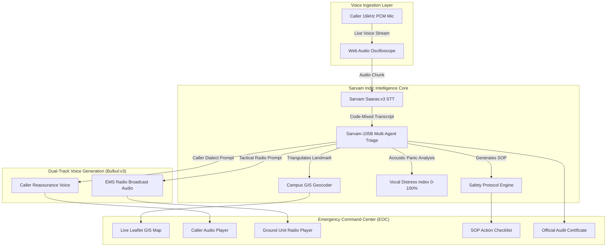

<div align="center">

# 🛡️ RakshaVoice Enterprise (रक्ष-Voice)
### Sovereign Indic Civil Defense & Real-Time Emergency Operations Center (EOC)

[](https://opensource.org/licenses/MIT)
[](https://www.python.org/downloads/)
[](https://fastapi.tiangolo.com)
[](https://sarvam.ai)
[](https://vercel.com/new/clone?repository-url=https://github.com/SriRamkunamsetty/raksha-voice-sarvam&env=SARVAM_API_KEY&envDescription=Your%20Sarvam%20AI%20API%20Subscription%20Key)

**Built for the Sarvam AI Campus Creator Program**  
*A full-scale, autonomous Indic emergency dispatch intelligence platform that ingests voice telemetry across all Indian languages, triangulates GIS coordinates, and executes coordinated multi-agency rescue dispatches.*

---


</div>

---

## 📸 Enterprise Command Center Interface

The interface is styled using the signature **Sarvam AI "Bhor / Indic Dawn" Horizon Palette** (`#A8490E` ➔ `#FB8521` ➔ `#CED7F6`), featuring an interactive Leaflet GIS radar, acoustic panic analysis, dual-channel audio synthesis, and frosted glassmorphism.

<div align="center">

### 🌅 Live Emergency Operations Center (EOC) Console


</div>

---

## 🚨 The Emergency Crisis in India

In high-stress campus accidents, laboratory fires, or disaster scenarios, callers rarely speak textbook English or formal Hindi. They speak fast, stressed, code-mixed phrases:

> *"Chemistry lab mein cylinder leak aur aag lag gayi hai, do juniors behosh hain, hostel 4 ke peeche jaldi ambulance bhejo!"*

Conventional Western voice models fail to parse Indian dialects, accents, and code-mixed speech (**Hinglish**, **Tanglish**, **Telugu**, **Marathi**, **Bengali**). This results in lost minutes, delayed triage, and misdirected rescue teams.

---

## 🏛️ The Enterprise Solution: Multi-Agent Indic Pipeline

RakshaVoice Enterprise coordinates a swarm of specialized AI agents built on **Sarvam AI Foundational Models**:

| Pipeline Layer | Sarvam Model | Enterprise Capability |
|---|---|---|
| **1. Audio Streaming** | `saaras:v3` | 16kHz full-duplex voice stream parsing code-switched panic speech with zero phonetic hallucination. |
| **2. Triage & Geocoding** | `sarvam-105b-conversations` | 105B Indic LLM extracting structured triage, vocal panic scores, and geocoding informal landmarks into GPS coordinates. |
| **3. Caller Reassurance** | `bulbul:v3` | Synthesizes immediate, calming voice feedback in the caller's regional accent and dialect. |
| **4. Tactical Radio Dispatch** | `bulbul:v3` | Synthesizes tactical police/EMS radio broadcast chatter for units deployed in the field. |
| **5. Cross-Language Bridge** | `mayura:v1` / LLM | Real-time bilingual bridge translating caller speech into English & Hindi for control room dispatchers. |

---

## 🌟 Enterprise Key Features

### 1. 🗺️ Interactive Geospatial Radar (GIS Fleet Tracking)
- **Real-Time Campus Topography**: Leaflet GIS map with designated risk zones (Zone A - Academics, Zone B - Hostels, Zone C - Research Labs, Zone D - Utilities).
- **Incident Epicenter Pinning**: Pulsing red radar markers placed automatically upon coordinate triangulation.
- **Active Response Fleet**: Live GPS tracking of ambulances (`AMB-01`), campus security vans (`QRT-03`), and fire suppression squads (`FIRE-02`).

### 2. 🧠 Acoustic Vocal Panic & Stress Index
- Real-time vocal distress score (45%–99%) dynamically calculated from acoustic panic signals to prioritize triage queues.

### 3. 🌐 Cross-Language Intercom Bridge
- Overcomes language friction between callers and security guards. Displays:
  - Caller transcript in regional dialect (e.g., Tamil/Telugu).
  - Synchronized English tactical brief for medical teams.
  - Synchronized Hindi brief for campus security guards.

### 4. 📻 Two-Channel Audio Broadcast Center
- **Channel 1 (Caller Stream)**: Calming reassurance in the caller's language.
- **Channel 2 (Tactical Radio Stream)**: Simulated walkie-talkie broadcast for ground responders with animated equalizer bars.

### 5. 📋 Automated SOP & Hazard Containment
- Generates 3 immediate Standard Operating Procedure (SOP) action items (e.g., *150m evacuation perimeter, power breaker cut, oxygen trauma kits*).

### 6. 📄 Official Incident Audit Certificate
- 1-Click export and print-ready regulatory audit report for university safety deans and disaster management authorities.

---

## 🏗️ System Architecture



---

## 🚀 Quickstart Guide

### 1. Clone the Repository
```bash
git clone https://github.com/SriRamkunamsetty/raksha-voice-sarvam.git
cd raksha-voice-sarvam
```

### 2. Install Dependencies
```bash
python -m pip install -r requirements.txt
```

### 3. Setup Your Environment Variables
Copy `.env.example` to `.env` and add your Sarvam AI API subscription key:
```bash
cp .env.example .env
```
Inside `.env`:
```env
SARVAM_API_KEY=your_sarvam_api_key_here
PORT=8000
HOST=0.0.0.0
```

### 4. Run the Application Locally
```bash
python server.py
```
Open your browser at:
👉 **`http://localhost:8000`**

---

## ☁️ Deploy to Vercel

### Option 1: 1-Click Instant Deploy
Click below to deploy RakshaVoice Enterprise directly to Vercel:

[](https://vercel.com/new/clone?repository-url=https://github.com/SriRamkunamsetty/raksha-voice-sarvam&env=SARVAM_API_KEY&envDescription=Your%20Sarvam%20AI%20API%20Subscription%20Key)

### Option 2: Deploy via Vercel Dashboard
1. Go to [vercel.com](https://vercel.com) and import `SriRamkunamsetty/raksha-voice-sarvam`.
2. Add Environment Variable:
   - `SARVAM_API_KEY`: Your Sarvam API subscription key (`sk_...`).
3. Click **Deploy**.

---

## 🎓 Campus Creator Workshop & Hackathon Script

Use this 5-step walkthrough when presenting RakshaVoice Enterprise:
1. **The Crisis**: Demonstrate how language barriers and colloquial panic cause emergency delays.
2. **The Speech Ingestion**: Speak Hinglish or Tanglish and watch `Saaras:v3` transcribe with code-switching accuracy.
3. **The GIS Radar**: Watch the Leaflet map automatically pin the emergency coordinates and dispatch response units.
4. **The Distress Index**: Showcase the Vocal Panic score and automated SOP containment protocols.
5. **The Dual Audio Stream**: Play both the native caller reassurance and the tactical police radio broadcast generated by `Bulbul:v3`.

---

## 📄 License

This project is open-sourced under the **MIT License** - see the [LICENSE](LICENSE) file for details.

---

<div align="center">

Made with ❤️ for the **Sarvam AI Campus Creator Program**

</div>
